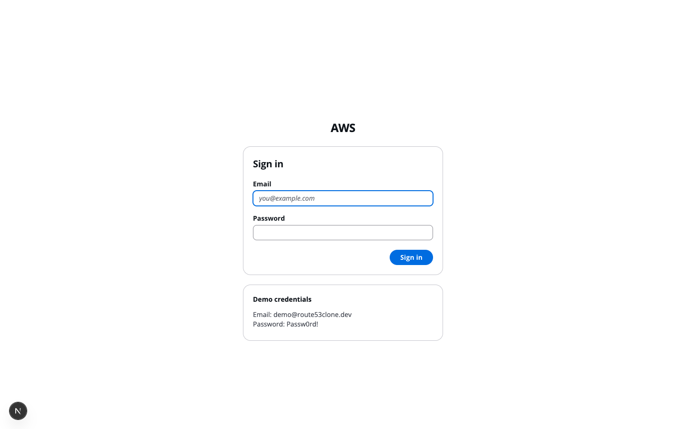
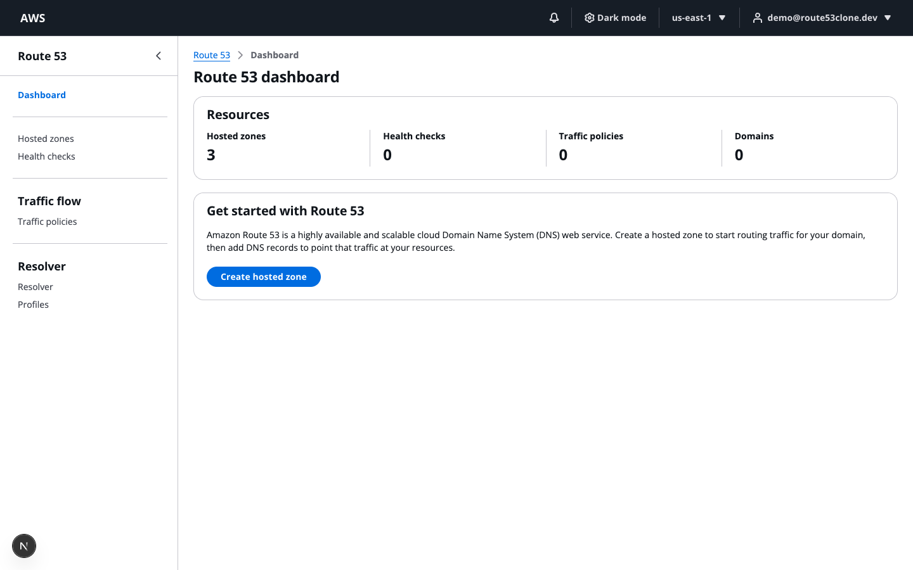
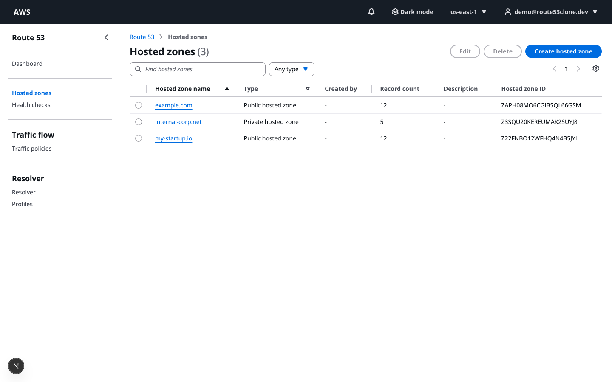
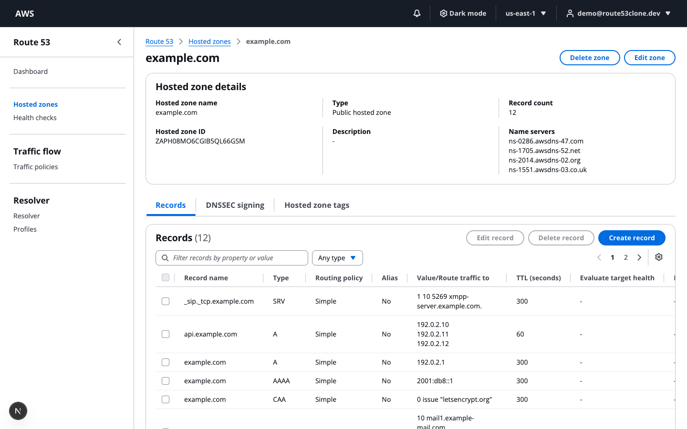
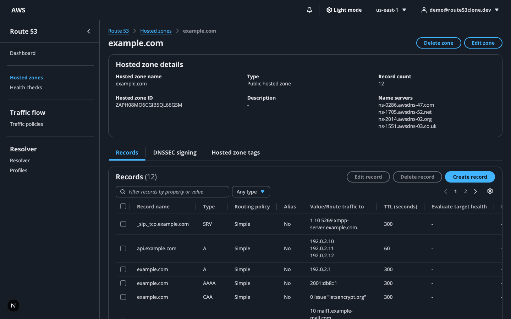

# AWS Route 53 Clone

A functional clone of the AWS Route 53 console — hosted zones and DNS records
with full CRUD, built on **Next.js + Cloudscape Design System** (the actual
component library the real AWS Console is built with), **FastAPI**, and
**SQLite**.

> **Demo credentials:** `demo@route53clone.dev` / `Passw0rd!` (also shown on
> the sign-in page).

---

## Setup instructions

### Prerequisites

- Node.js 22+ and npm
- Python 3.12
- (Optional) Docker, for the one-command path

### Backend

```bash
cd backend
python3.12 -m venv .venv
source .venv/bin/activate
pip install -r requirements.txt
cp .env.example .env
python -m app.seed          # idempotent — creates the demo user + 3 zones
uvicorn app.main:app --reload --port 8000
```

Backend is now at `http://localhost:8000` — interactive API docs at
`http://localhost:8000/docs`.

### Frontend

```bash
cd frontend
npm ci
cp .env.local.example .env.local
npm run dev
```

Frontend is now at `http://localhost:3000`.

### One command with Docker

```bash
docker compose up
```

Builds and runs both services, wires them together, and persists SQLite in a
named volume. Same demo credentials apply. The backend seeds itself on
every container start (idempotent, so this is safe).

### Running tests

```bash
cd backend && pytest -v          # 50 tests
cd frontend && npx tsc --noEmit && npm run lint && npm run build
```

---

## Architecture overview

### Layering

```
Backend                              Frontend
────────────────────────────────     ────────────────────────────────
api/routes/*.py   HTTP only          app/**/page.tsx     route entry, thin
schemas/*.py      Pydantic DTOs      components/**       UI, presentational
services/*.py     ALL business       lib/hooks/*.ts       TanStack Query —
                  rules. No                                the only place
                  FastAPI imports.                          fetching starts
validation/*.py   Pure functions,    lib/api/*.ts         typed fetch
                  no I/O                                    wrappers, one
models/*.py       SQLAlchemy         lib/validation/*.ts   per resource
                  columns only                             client mirror of
                                                             the backend rules
```

**Why this split matters:** routes stay under ~30 lines because they only
parse input, call a service, and return a DTO. All the Route 53 business
rules (auto-created NS/SOA, deletion guards, CNAME conflicts, alias handling)
live in `services/`, which never imports FastAPI — so they're testable in
isolation and the HTTP layer can't accidentally grow business logic.

### Request lifecycle (traced through "create a DNS record")

```
Browser
  → RecordForm.tsx validates client-side (lib/validation/records.ts —
    a direct TS port of the backend's record_rules.py, for instant feedback)
  → lib/hooks/useRecords.ts → useMutation()
  → lib/api/records.ts → apiFetch('POST', '/hosted-zones/{id}/records')
      (credentials:'include' — the session cookie rides along)
                    │  HTTP
Backend             ▼
  → api/routes/records.py — auth dependency, parses RecordCreate
  → services/record_service.py::create_record()
      · zone lookup + ownership check         → 404 if missing
      · validation/record_rules.py::validate() → 400 InvalidChangeBatch
      · CNAME apex / coexistence checks        → 400
      · duplicate (name,type,set_id) check     → 400 RRSetAlreadyExists
      · writes DnsRecord + a Change row (status PENDING)
  → returns RecordResponse + ChangeInfo
                    │  JSON
Browser             ▼
  → onSuccess: invalidateQueries(['records', zoneId]) → table refetches
  → NotificationContext.push() → Flashbar banner
  → ChangeStatusIndicator polls GET /changes/{id} every 2s until INSYNC
```

Every mutation in the app follows this same shape. Components never call
`fetch` directly — only `lib/api/*` does; only `lib/hooks/*` calls that.

### Folder structure

```
route53-clone/
├── backend/
│   ├── app/
│   │   ├── main.py, config.py, database.py, seed.py, errors.py
│   │   ├── models/         SQLAlchemy: user, session, hosted_zone,
│   │   │                   dns_record, change, tag
│   │   ├── schemas/        Pydantic DTOs
│   │   ├── api/
│   │   │   ├── deps.py     get_db, get_current_user, pagination
│   │   │   └── routes/     auth, hosted_zones, records, changes, export, account
│   │   ├── services/       auth, zone, record, change, id_generator, bind
│   │   └── validation/     record_rules.py — pure per-type validators
│   └── tests/               50 pytest cases
│
└── frontend/src/
    ├── app/
    │   ├── login/
    │   └── (console)/       route group — everything behind the auth guard
    │       ├── layout.tsx   auth guard + ConsoleShell
    │       ├── error.tsx    React error boundary
    │       ├── dashboard/
    │       └── hosted-zones/
    │           ├── page.tsx, create/
    │           └── [zoneId]/
    │               ├── page.tsx, edit/
    │               └── records/create/, records/[recordId]/edit/
    ├── components/
    │   ├── layout/           ConsoleShell, TopNavBar, SideNav, Breadcrumbs
    │   ├── hosted-zones/      table, form, details panel, tabs, tags, delete modal
    │   ├── records/           table, form, type/value/TTL/routing fields, delete modal
    │   └── common/            EmptyState, TableHeaderActions, ValueWithLabel
    ├── context/                Auth, Notification, Theme, Breadcrumb
    └── lib/
        ├── api/                 one typed module per resource
        ├── hooks/                TanStack Query hooks
        ├── validation/records.ts client mirror of the backend rules
        └── constants/            record types, routing policies, nav tree
```

---

## Database schema

SQLite, created via `Base.metadata.create_all()` on startup.

```
users ──< sessions
  │
  └──< hosted_zones ──< dns_records
              │  └──< changes
              └──< tags
```

| Table | Key columns |
|---|---|
| `users` | `id`, `email` (unique), `name`, `password_hash`, `aws_account_id` |
| `sessions` | `token` (PK, opaque), `user_id`, `expires_at` |
| `hosted_zones` | `id` (`Z` + 20 alnum), `name` (FQDN, trailing dot), `type` (Public/Private), `comment`, `caller_reference` (unique), `created_by`, `owner_user_id`. `UNIQUE(owner_user_id, name, type)` |
| `dns_records` | `id`, `zone_id` (FK, `ON DELETE CASCADE`), `name`, `type`, `ttl`, **`values` (JSON-encoded list)**, `routing_policy`, `set_identifier`, `weight`, `alias`, `alias_target`, `evaluate_target_health`, `health_check_id`, `is_system`. `UNIQUE(zone_id, name, type, set_identifier)` |
| `changes` | `id` (`C` + 14 alnum), `zone_id`, `status` (PENDING→INSYNC), `submitted_at` |
| `tags` | `id`, `resource_id` (FK → hosted_zones), `key`, `value`. `UNIQUE(resource_id, key)` |

**Why `values` is a JSON array, not one row per value:** a Route 53 record
*set* holds multiple values under one name+type — the apex NS record holds
four nameservers, an A record can hold several IPs. The console renders them
newline-separated in a single table cell and edits them in a single textarea.
One row per value would produce four NS rows where AWS shows exactly one, so
it's modelled as `DnsRecord.values: list[str]` via a `JSONEncodedList`
SQLAlchemy `TypeDecorator`.

`PRAGMA foreign_keys=ON` is set on every connection so the cascade delete
(deleting a zone deletes its records/changes/tags) actually fires — SQLite
doesn't enforce foreign keys by default.

---

## API overview

Base path `/api`. Session auth via an httpOnly `session` cookie. Full
interactive reference at `/docs` (OpenAPI/Swagger).

| Method | Path | Notes |
|---|---|---|
| POST | `/auth/login` | Sets the session cookie |
| POST | `/auth/logout` | Clears it |
| GET | `/auth/me` | Current user or 401 |
| GET | `/account` | Mocked account/region info for the top nav |
| GET | `/hosted-zones` | `search`, `type`, `sort`, `order`, `page`, `page_size` |
| POST | `/hosted-zones` | Auto-creates NS + SOA records |
| GET/PATCH/DELETE | `/hosted-zones/{id}` | DELETE fails with `HostedZoneNotEmpty` while non-system records remain |
| GET/PUT | `/hosted-zones/{id}/tags` | Replace-all semantics on PUT |
| GET | `/hosted-zones/{id}/export?format=json\|bind` | File download |
| GET | `/hosted-zones/{id}/records` | Same list params as zones, plus `type` |
| POST | `/hosted-zones/{id}/records` | Full per-type validation |
| GET/PATCH/DELETE | `/hosted-zones/{id}/records/{id}` | Name/type immutable after creation (matches real Route 53 — delete & recreate instead); system records (NS/SOA) can't be deleted |
| GET | `/changes/{id}` | `PENDING` for 5s after submission, then `INSYNC` |

**Error envelope**, every 4xx/5xx:

```json
{ "error": { "code": "InvalidChangeBatch", "message": "...", "field": "values", "errors": ["..."] } }
```

Codes: `InvalidInput`, `InvalidChangeBatch`, `HostedZoneAlreadyExists`,
`HostedZoneNotEmpty`, `NoSuchHostedZone`, `NoSuchRecord`,
`RRSetAlreadyExists`, `NotAuthorized`.

---

## Route 53 behaviours implemented

These are what separate this from a generic CRUD app:

- **Auto-created system records** — every new public zone gets an NS record
  (4 nameservers, TTL 172800) and an SOA record (TTL 900, AWS's real default
  serial/refresh/retry/expire/minimum values), both marked `is_system` and
  undeletable.
- **Deletion guard** — a zone can only be deleted once nothing but its
  NS/SOA records remain, exactly mirroring the real `HostedZoneNotEmpty`
  error. The UI surfaces this as an inline alert in the delete modal with a
  link to the Records tab.
- **Change propagation** — every mutation returns a change with status
  `PENDING`, computed to flip to `INSYNC` five seconds after submission (no
  background worker — it's derived from elapsed time on read). The UI polls
  and shows a status pill, same as the real console.
- **Per-type validation**, both server-side (authority) and mirrored
  client-side (instant feedback) — IPv4/IPv6 shape, CNAME single-value +
  no-apex + no-coexistence, TXT quoting/255-char limit, MX/SRV field counts,
  CAA tag enum, TTL range.
- **Alias records** — checking "Alias" swaps the value textarea for a
  target-resource input and removes the TTL requirement, matching how
  Route 53 alias records actually behave (they route to a resource, not a
  literal value).
- **Name/type immutability** — editing a record can't change its name or
  type, same as the real console (you delete and recreate instead).

## Deliberate deviations

- **Hosted zone renaming.** The real Route 53 console only allows editing a
  zone's comment and tags — not its name. This clone additionally allows a
  guarded rename (with a warning that it rewrites every record's suffix),
  so the assignment's "Edit Hosted Zones" requirement is unambiguously met.

## Features checklist

| Requirement | Where |
|---|---|
| Login / logout / session persistence | `context/AuthContext.tsx`, `services/auth_service.py` |
| Hosted zones — view/search/create/edit/delete | `components/hosted-zones/`, `services/zone_service.py` |
| DNS records — all 9 types, view/search/create/edit/delete | `components/records/`, `services/record_service.py` |
| Tables, forms, search, filters, pagination, modals, notifications | Cloudscape `Table`/`Form`/`Modal`/`Flashbar` throughout |
| Mocked Dashboard, Health Checks, Traffic Policies, Resolver, Profiles | `app/(console)/*/page.tsx` + `ComingSoon.tsx` |
| Dark mode (bonus) | `context/ThemeContext.tsx`, `@cloudscape-design/global-styles` |
| SQLite persistence | Verified across backend restarts and Docker volume restarts |

---

## Screenshots

| Sign in | Dashboard |
|---|---|
|  |  |

| Hosted zones | Zone detail |
|---|---|
|  |  |

**Dark mode** (bonus feature — toggle in the top nav):



---

## Deployment

**Frontend → Vercel**, **backend → Fly.io with a mounted volume** (SQLite
needs a persistent disk, which rules out plain serverless).

```bash
# Backend
cd backend
fly launch --no-deploy         # creates the app, don't deploy yet
fly volumes create route53_data --size 1
fly secrets set SESSION_SECRET=$(openssl rand -hex 32)
fly deploy

# Frontend
cd frontend
vercel --prod
# set NEXT_PUBLIC_API_BASE_URL to the Fly URL + /api in Vercel's env vars,
# then redeploy so it's baked into the build (NEXT_PUBLIC_* vars are
# inlined at build time, not read at runtime)
```

### The cross-origin cookie gotcha

Frontend and backend end up on different domains, so the session cookie is
third-party. This is already handled in `api/routes/auth.py`:

- `samesite="none"` + `secure=True` in production (`samesite="lax"` only
  works when frontend and backend share a site)
- CORS `allow_origins` set to the exact Vercel URL (not `*`, which is
  incompatible with `allow_credentials=True`)

Driven by the `ENVIRONMENT` env var — set it to `production` on Fly, and set
`CORS_ORIGINS` to your actual Vercel URL in `fly.toml`. Get either of these
wrong and login will appear to succeed while `/auth/me` 401s forever.

Remember to seed the production database once after the first deploy (the
Docker `CMD` already does this automatically on every container start,
idempotently).
